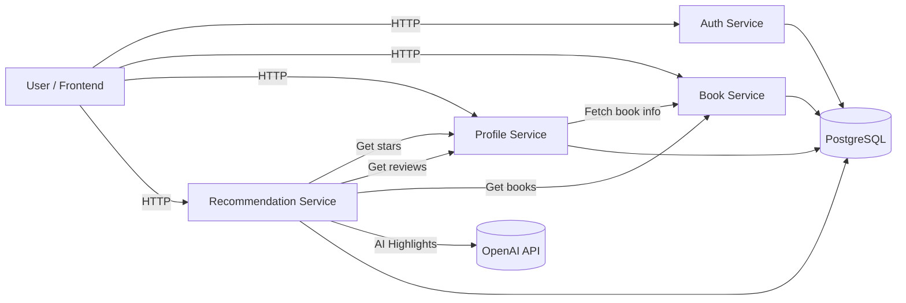
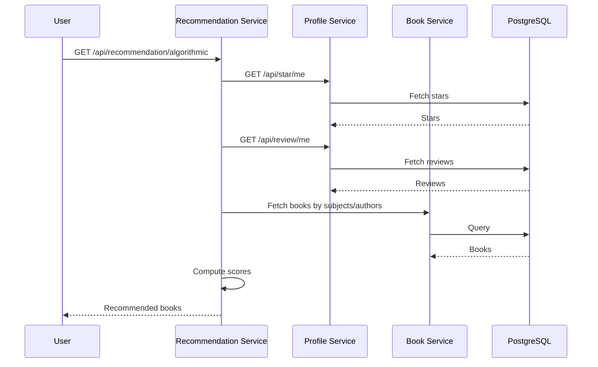
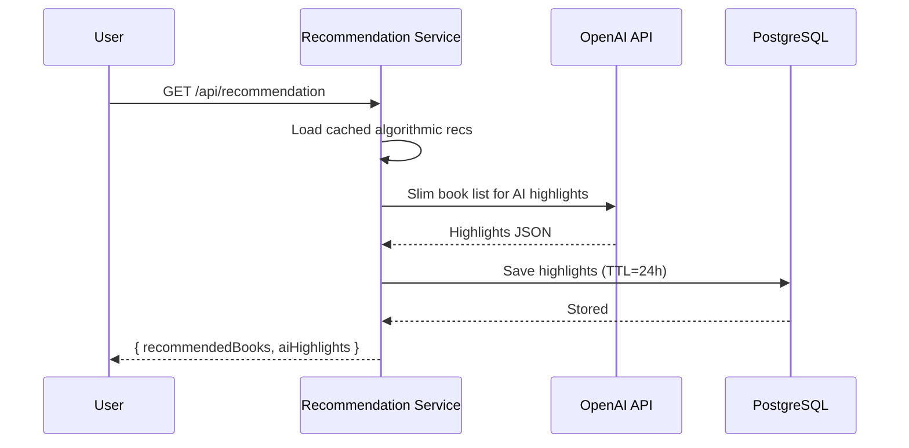
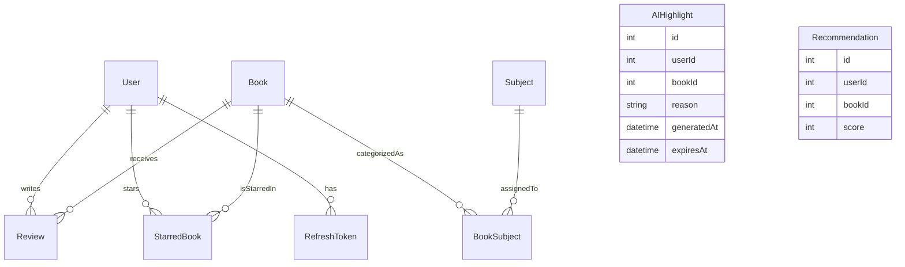

# **Book Space Backend**

A microservice-based backend for a book discovery & recommendation platform.  
Includes:

- Authentication service
- Book catalog service
- Profile service (stars, reviews, profile)
- Recommendation service (algorithmic + AI-enhanced)
- Book fetcher/seeder
- PostgreSQL database
- OpenAI integration for book highlight generation

Built as part of a diploma project with production-like architecture.

---

# **Architecture Overview**

The backend consists of multiple independent services communicating over HTTP inside a Docker network.

### Microservice Architecture Diagram



---

# **Recommendation Engine Architecture**

### 1️Algorithmic Recommendation Flow



---

### 2️ AI-Enhanced Recommendation Flow



---

# **Database Schema (ER Diagram)**



---

# **Installation**

Clone the repository:

```bash
git clone https://github.com/DubleXin/book_space_backend.git
cd book-space-backend

```

---

# **Makefile Commands**

Command

Description

`make ENV=dev compose-up`

Start all services

`make ENV=dev compose-down`

Stop all services

`make ENV=dev compose-build`

Build all Docker images

`make logs service=name`

View logs of a specific service

---

# **Environment Variables**

Each service has its own `.env` file.  
Below is the combined `.env.example` for the project.

---

## **Root / General `.env.example`**

```dotenv
POSTGRES_USER="postgres user"
POSTGRES_PASSWORD="postgres password"
POSTGRES_DB="postgres db name"
DATABASE_URL="postgres db url"

JWT_SECRET="general jwt secret"

PGADMIN_EMAIL="pgadmin login"
PGADMIN_PASSWORD="pgadmin password"

```

---

## **Auth Service — `.env.example`**

```dotenv
PORT="auth service port"
JWT_SECRET_REFRESH="jwt secret for refresh tokens"

```

---

## **Book Fetcher / Seeder — `.env.example`**

```dotenv
USER_AGENT_CREDITS="user agent contact email"

```

---

## **Book Service — `.env.example`**

```dotenv
PORT="book service port"

```

---

## **Profile Service — `.env.example`**

```dotenv
PORT="profile service port"
BOOK_SERVICE_URL="book service address"

```

---

## **Recommendation Service — `.env.example`**

```dotenv
PORT="recommendation service port"
PROFILE_SERVICE_URL="profile service address"
BOOK_SERVICE_URL="book service address"
OPENAI_API_KEY="open ai api key"

```

---

# Running via Docker

Build:

```bash
make ENV=dev compose-build

```

Start:

```bash
make ENV=dev compose-up

```

Stop:

```bash
make ENV=dev compose-down

```

---

# Authentication

Uses:

- JWT for access tokens (`JWT_SECRET`)
- Refresh tokens (rotating, stored in DB)
- Logout invalidates a refresh token
- Access tokens required for profile, review, stars, and recommendations

---

# API Documentation

This backend includes the following microservices:

- **Auth Service**

- **Book Service**

- **Profile Service**

- **Review Service**

- **Stars Service**

- **Recommendation Service**

Most routes follow the unified response format.

---

# Unified Response Format

### Success:

```json

{
"success": true,

"data": { ... }
}

```

### Error:

```json
{
  "success": false,
  "message": "Error description"
}
```

### Special Fields Used in Some Routes

- `token`, `refreshToken` — Auth service
- `count` — list endpoints

- `cached`, `cachedAlgorithmic` — recommendation service

- `recommendedBooks`, `aiHighlights` — AI recommendation output

---

# Auth Service — `/api/auth`

## **POST /api/auth/login**

### Request Body

```json
{
  "email": "example1@example.com",
  "password": "123"
}
```

### Response Example

```json
{
  "success": true,
  "token": "ACCESS_TOKEN_HERE",
  "refreshToken": "REFRESH_TOKEN_HERE"
}
```

---

## **POST /api/auth/register**

### Request Body

```json
{
  "email": "example1@example.com",
  "password": "123"
}
```

---

## **POST /api/auth/refresh**

### Request Body

```json
{
  "token": "<refresh_token_here>"
}
```

### Response

```json
{
  "success": true,
  "token": "NEW_ACCESS_TOKEN",
  "refreshToken": "NEW_REFRESH_TOKEN"
}
```

---

## **POST /api/auth/logout**

### Request Body

```json
{
  "token": "<refresh_token_here>"
}
```

---

## **GET /health**

## **GET /health/db**

# Book Service — `/api/book`

## **GET /api/book**

Fetch list of books with pagination and optional filters.

### Supported query params

- `limit`

- `offset`

- `subject` (comma-separated)

- `author` (comma-separated)

### Example

```
/api/book?limit=10&offset=0&subject=horror
```

### Response Example

```json
{
  "success": true,
  "count": 10,
  "data": [
    {
      "id": 103,
      "title": "Brood of the Witch-Queen",
      "author": "Sax Rohmer",
      "publishedYear": 1924,
      "coverUrl": "...",
      "description": "...",
      "externalSource": "openlibrary",
      "externalId": "/works/OL2288676W",
      "createdAt": "2025-11-09T16:05:23.551Z",
      "updatedAt": "2025-11-09T16:05:23.551Z",
      "subjects": [{ "name": "horror" }]
    }
  ]
}
```

---

## **GET /api/book/:id**

### Response Example

```json
{
  "success": true,
  "data": {
    "id": 13,
    "title": "Ozma of Oz",
    "author": "L. Frank Baum",
    "publishedYear": 1907,
    "coverUrl": "...",
    "description": "...",
    "externalSource": "openlibrary",
    "externalId": "/works/OL18415W",
    "createdAt": "2025-11-09T16:05:23.145Z",
    "updatedAt": "2025-11-09T16:05:23.145Z",
    "subjects": [{ "name": "fantasy" }]
  }
}
```

---

## **GET /api/subject**

Returns all subjects.

### Response

```json
{
  "success": true,
  "data": [
    { "id": 1, "name": "fantasy" },
    { "id": 2, "name": "horror" }
  ]
}
```

---

## **GET /api/subject/:id**

Return books for a subject ID.

Example:

```
/api/subject/9?limit=5&offset=1
```

---

# Profile Service — `/api/profile`

Requires Bearer token.

---

## **GET /api/profile/me**

## **PUT /api/profile/me**

### Request Body

```json
{
  "username": "sasada",
  "bio": "full-stack dev"
}
```

---

# Stars — `/api/star`

## **POST /api/star/**

Toggle star.

### Body:

```json
{
  "bookId": "3"
}
```

---

## **GET /api/star/me**

## **GET /api/star/:userId**

Returns starred books for any user.

---

# Reviews — `/api/review`

## **POST /api/review/**

### Body

```json
{
  "bookId": "1",
  "message": "testing recommendations",
  "rating": "4"
}
```

---

## **GET /api/review/me**

## **GET /api/review/book/:id**

## **GET /api/review/:userId**

Returns enriched reviews including book data.

### Example

```json
{
  "success": true,
  "data": [
    {
      "id": 10,
      "userId": 5,
      "bookId": 1,
      "message": "...",
      "rating": 4,
      "book": {
        /* book metadata */
      }
    }
  ]
}
```

---

# Recommendation Service — `/api/recommendation`

## **GET /api/recommendation/algorithmic**

### Response Example

```json
{
  "success": true,
  "cached": true,
  "data": [
    {
      "id": 674,
      "userId": 5,
      "bookId": 11,
      "reason": "Matched by author/subject similarity",
      "score": 3,
      "generatedAt": "2025-11-14T10:06:17.062Z"
    }
  ],
  "message": "Using cached recommendations (algorithmic)"
}
```

---

## **GET /api/recommendation**

### Response Example

```json
{
  "success": true,
  "cachedAlgorithmic": true,
  "data": {
    "recommendedBooks": [
      /* algorithmic results */
    ],
    "aiHighlights": [
      {
        "id": 22,
        "bookId": 19,
        "reason": "This volume of Tolkien's epic saga deepens the journey...",
        "generatedAt": "2025-11-14T10:06:33.375Z",
        "expiresAt": "2025-11-15T10:06:17.070Z"
      }
    ]
  }
}
```

## **GET /health**

# **Caching & AI Notes**

- Algorithmic recommendations cached per user
- AI highlights cached for **24 hours**
- Cache stored in `AIHighlight` table
- Slim book data sent to OpenAI Responses API
- Model: `o3-mini`
- AI returns pure JSON (validated before saving)

---

# **Conclusion**

This backend demonstrates:

- Microservice architecture
- Clean service separation
- JWT-based auth
- PostgreSQL relational modeling
- Dockerized infrastructure
- Hybrid algorithmic + AI-recommendation engine
- Clear documentation and diagrams
